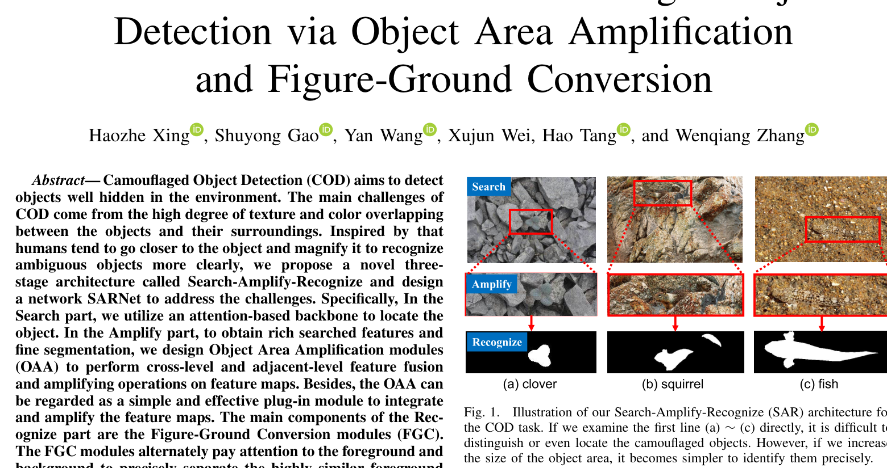
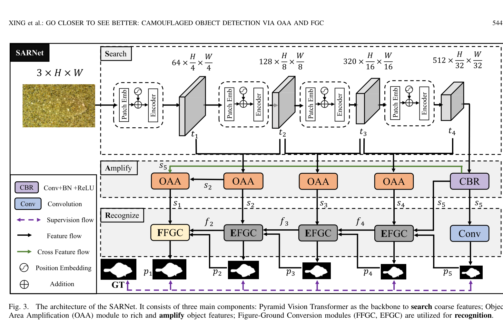
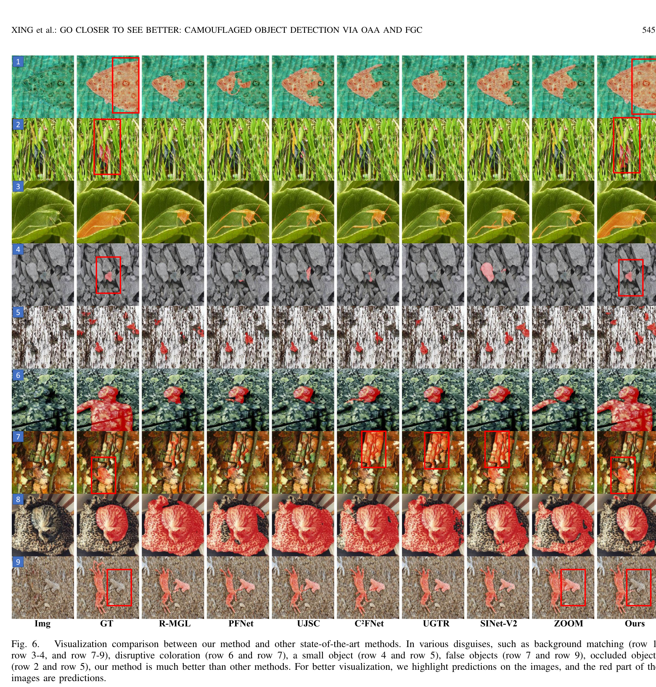
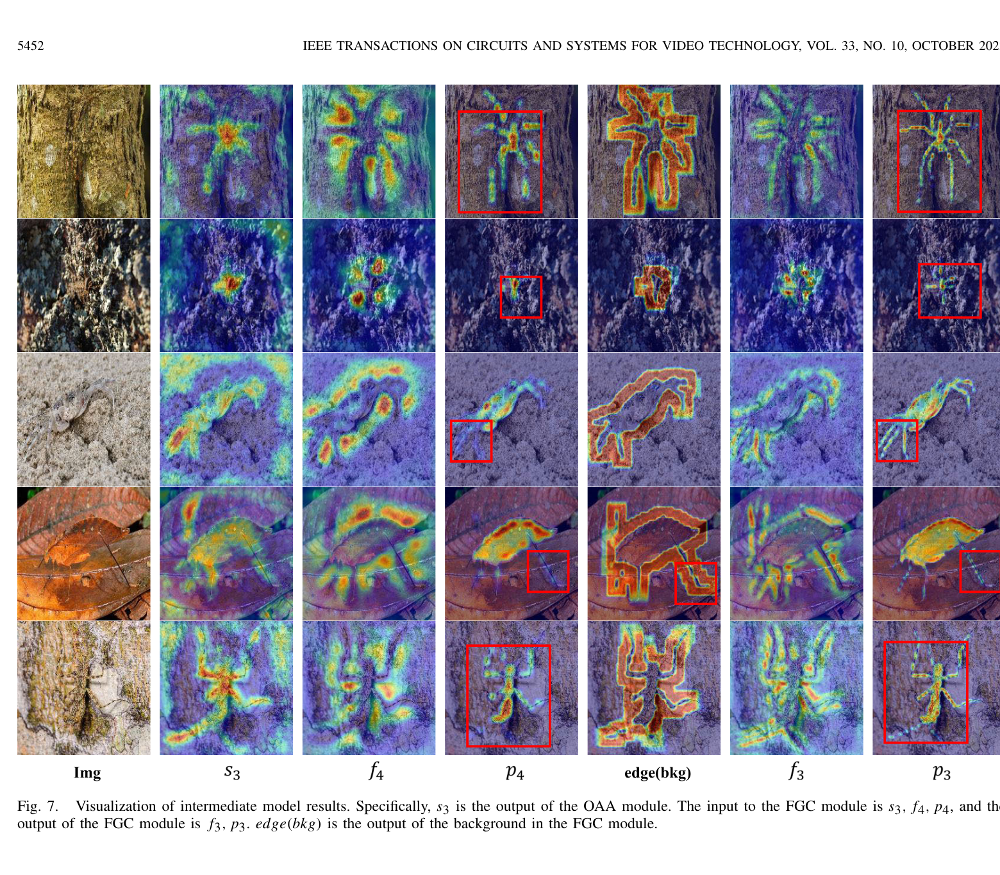
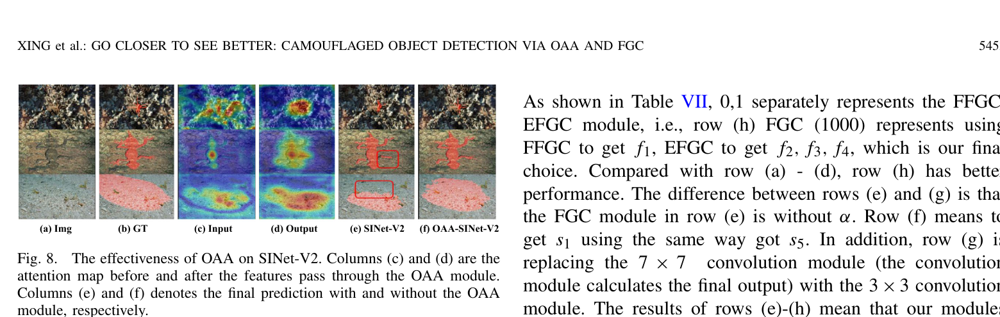

<p align="right">
  <a href="README.md">English</a> | <a href="README_zh.md">中文</a>
</p>

<p align="center">
  <h1 align="center">SARNet: Go Closer to See Better 🔍</h1>
  <p align="center">
    <strong>Camouflaged Object Detection via Object Area Amplification and Figure-Ground Conversion</strong>
  </p>
  <p align="center">
    <a href="https://ieeexplore.ieee.org/document/10065514"></a>
    <a href="https://github.com/Haozhe-Xing/SARNet"></a>
    <a href="https://github.com/Haozhe-Xing/SARNet/issues"></a>
    <a href="#license"></a>
  </p>
  <p align="center">
    <a href="#-highlights">Highlights</a> •
    <a href="#-architecture">Architecture</a> •
    <a href="#-results">Results</a> •
    <a href="#-visualization">Visualization</a> •
    <a href="#-quick-start">Quick Start</a> •
    <a href="#-citation">Citation</a>
  </p>
</p>

<p align="center">
  
  <br>
  <em>Figure 1: The proposed Search-Amplify-Recognize (SAR) paradigm. Unlike previous Search-Identify approaches, SARNet introduces an Amplify stage via OAA modules and a Recognize stage via FGC modules to progressively detect well-camouflaged objects.</em>
</p>

---

## 👋 Why This Project?

> **New to Camouflaged Object Detection (COD)?** You're in the right place!

SARNet is designed to be a **beginner-friendly yet research-grade** COD project. Whether you're a student exploring COD for the first time or a researcher looking for a solid baseline, this repo has everything you need:

- 📖 **Clean & Well-Commented Code** — Every module is clearly documented, making it easy to understand the full pipeline from data loading to model inference.
- 🎨 **Ready-to-Use Visualization Tools** — We open-source the scripts to generate **feature map heatmaps** and **prediction overlays** (see [Visualization](#-visualization)), so you can visually understand how the model works — not just look at numbers.
- 🧩 **Modular Architecture** — The OAA and FGC modules are self-contained and easy to plug into your own network for experimentation.
- 🚀 **End-to-End Workflow** — Training, inference, evaluation, and visualization are all included. Just clone, configure paths, and run!
- 📊 **Automatic Evaluation** — Metrics (S-measure, F-measure, MAE, E-measure) are computed and saved to Excel automatically after inference.

> 💡 *If this is your first COD project, we recommend starting with the [Quick Start](#-quick-start) section and then exploring the [Visualization](#-visualization) tools to build intuition about how camouflaged objects are detected.*

## ✨ Highlights

- 🎯 **Object Area Amplification (OAA)** — Fuses adjacent-level features to amplify target region representations, enabling the network to "go closer" to camouflaged objects.
- 🔄 **Figure-Ground Conversion (FGC)** — Progressively refines predictions by selectively attending to foreground/background regions that deeper layers missed.
- 🏆 **State-of-the-Art** — Achieves competitive performance on **4 major COD benchmarks** (CAMO, CHAMELEON, COD10K, NC4K).
- ⚡ **PVTv2 Backbone** — Leverages Pyramid Vision Transformer V2 for powerful multi-scale feature extraction.
- 🎨 **Open-Source Visualization Tools** — We provide ready-to-use scripts for **feature map heatmap generation** and **prediction overlay visualization** (see [Visualization](#-visualization)).

## 🏗 Architecture

<p align="center">
  
  <br>
  <em>Figure 3: Overall architecture of SARNet. The PVTv2 backbone extracts multi-scale features, which are then processed by Object Area Amplification (OAA) modules to fuse and amplify target features. Figure-Ground Conversion modules (FFGC, EFGC) progressively refine predictions by attending to foreground/background regions.</em>
</p>

**Key Design Insights:**

| Module | Role | Mechanism |
|--------|------|-----------|
| **OAA** | Object Area Amplification | Fuses current-level & deeper features via dual-branch Conv+Upsample+Concat |
| **FGC** (bg mode) | Background-aware Refinement | Morphological dilation − prediction → attends to missed regions |
| **FGC** (fg mode) | Foreground-aware Refinement | Uses prediction map as attention weights for foreground enhancement |
| **CBR** | Channel Reduction | Conv → BatchNorm → ReLU on the deepest features |

## 📊 Results

### Quantitative Comparison on COD Benchmarks

> All metrics are reported using the same evaluation protocol. ↑ means higher is better, ↓ means lower is better.

| Dataset | S-measure ↑ | weighted F ↑ | MAE ↓ | mean E ↑ | mean F ↑ |
|:-------:|:-----------:|:------------:|:-----:|:--------:|:--------:|
| **CAMO** | 0.796 | 0.700 | 0.075 | 0.850 | 0.754 |
| **CHAMELEON** | 0.888 | 0.830 | 0.032 | 0.945 | 0.859 |
| **COD10K** | 0.815 | 0.667 | 0.037 | 0.886 | 0.720 |
| **NC4K** | 0.843 | 0.752 | 0.048 | 0.897 | 0.787 |

> 💡 *Please refer to the paper for full comparison tables with other methods.*

### Qualitative Comparison

<p align="center">
  
  <br>
  <em>Figure 6: Visual comparison with state-of-the-art methods. SARNet produces more accurate and complete segmentation masks, especially for objects with complex camouflage patterns. Our method effectively handles challenging cases such as small objects, objects with similar texture to the background, and multiple camouflaged instances.</em>
</p>

## 🎨 Visualization

> **📢 We open-source all visualization tools used in the paper!** You can reproduce the feature heatmaps and prediction overlays shown below using the provided scripts in the `display_heatmaps/` directory.

### Feature Map Heatmaps

<p align="center">
  
  <br>
  <em>Figure 7: Feature map visualization at different stages. The heatmaps demonstrate how OAA and FGC modules progressively focus on camouflaged objects. Warmer colors indicate higher activation, showing that deeper features attend to broader regions while refined features precisely localize object boundaries.</em>
</p>

Generate feature map heatmaps with the open-source script:

```bash
cd display_heatmaps && python heatmap.py
```

> The script loads intermediate feature maps, applies colormap transformations, and overlays heatmaps on the original images. See [`display_heatmaps/heatmap.py`](display_heatmaps/heatmap.py) for details.

### Feature Visualization Analysis

<p align="center">
  
  <br>
  <em>Figure 8: Detailed feature visualization showing the effect of OAA and FGC modules. (a-b) Features before/after OAA demonstrate amplified object area attention. (c-d) Features before/after FGC show refined figure-ground separation.</em>
</p>

### Prediction Overlay

Overlay prediction maps on original images for qualitative analysis:

```bash
cd display_heatmaps && python combine.py
```

> The script generates side-by-side comparisons of input images, ground truth masks, and model predictions. See [`display_heatmaps/combine.py`](display_heatmaps/combine.py) for details.

---

## 📦 Pretrained Models & Prediction Maps

| Resource | Backbone | Download |
|:--------:|:--------:|:--------:|
| Pretrained Model | PVTv2-B3 | [](https://drive.google.com/drive/folders/1n80O0RIAe4KT08SZG-UK6HsWgD_qouoQ?usp=sharing) |
| Prediction Maps | — | [](https://drive.google.com/drive/folders/1rZ9IrbFz4dggik1vnK53PnNNy7l-1X_r?usp=sharing) |

## 🚀 Quick Start

### 1. Environment Setup

```bash
# Clone the repository
git clone https://github.com/Haozhe-Xing/SARNet.git
cd SARNet

# Create conda environment
conda create -n sarnet python=3.8.13 -y
conda activate sarnet

# Install dependencies
pip install -r requirements.txt
```

**Requirements:** Python 3.8 · PyTorch · PVTv2 pretrained weights ([download](https://github.com/whai362/PVT))

### 2. Dataset Preparation

Download [COD10K](https://github.com/DengPingFan/SINet) and organize as:

```
<your_data_root>/
└── COD10K/
    ├── TrainDataset1/
    │   ├── Imgs/          # Training images (.jpg)
    │   └── GT/            # Ground truth masks (.png)
    └── TestDataset/
        ├── CHAMELEON/
        │   ├── Imgs/
        │   └── GT/
        ├── CAMO/
        │   ├── Imgs/
        │   └── GT/
        ├── COD10K/
        │   ├── Imgs/
        │   └── GT/
        └── NC4K/
            ├── Imgs/
            └── GT/
```

Then update the `root` path in [`config.py`](config.py).

### 3. Training

```bash
python train.py
```

<details>
<summary><b>⚙️ Training Configuration (click to expand)</b></summary>

| Parameter | Default | Description |
|-----------|---------|-------------|
| `pvt_name` | `pvt_v2_b3` | PVTv2 backbone variant |
| `args['scale']` | `384` | Input image resolution |
| `args['epoch_num']` | `100` | Number of training epochs |
| `args['lr']` | `1e-3` | Initial learning rate |
| `args['optimizer']` | `SGD` | Optimizer (`SGD` / `Adam`) |
| `args['train_batch_size']` | `2` | Training batch size |
| `args['lr_decay']` | `0.9` | Polynomial LR decay power |

</details>

### 4. Inference & Evaluation

```bash
python new_infer.py
```

Evaluation metrics (S-measure, weighted F-measure, MAE, E-measure, F-measure) are automatically saved to an Excel file.

### 5. Visualization

We provide open-source visualization tools for reproducing all visual results in the paper. See the [Visualization](#-visualization) section for detailed examples and instructions.

```bash
# Feature map heatmaps (reproduces Fig. 7 & Fig. 8 in the paper)
cd display_heatmaps && python heatmap.py

# Overlay predictions on images (reproduces visual comparisons)
cd display_heatmaps && python combine.py
```

## 📁 Project Structure

```
SARNet/
├── SARNet.py             # 🧠 Core network (OAA + FGC modules)
├── pvtv2.py              # 🦴 PVTv2 backbone encoder
├── train.py              # 🏋️ Training pipeline
├── new_infer.py          # 🔍 Inference & evaluation
├── config.py             # ⚙️ Path configuration
├── datasets.py           # 📂 Dataset utilities
├── loss.py               # 📉 Loss functions (Structure, IoU, Dice)
├── joint_transforms.py   # 🔄 Joint image-mask augmentations
├── metric_caller.py      # 📏 Metric computation
├── excel_recorder.py     # 📊 Excel metric recording
├── misc.py               # 🔧 Utility functions
├── excel.py              # 📝 LaTeX table formatter
├── requirements.txt      # 📋 Python dependencies
└── display_heatmaps/     # 🎨 Visualization tools
    ├── heatmap.py        #    Feature map heatmap generation
    └── combine.py        #    Prediction overlay visualization
```

## 📖 Citation

If you find this work helpful for your research, please consider citing our paper and giving a ⭐:

```bibtex
@article{xing2023go,
  title     = {Go Closer to See Better: Camouflaged Object Detection via Object Area Amplification and Figure-Ground Conversion},
  author    = {Xing, Haozhe and Wang, Haiyu and Li, Yanye and Ling, Haibin},
  journal   = {IEEE Transactions on Circuits and Systems for Video Technology},
  volume    = {33},
  number    = {10},
  pages     = {5595--5608},
  year      = {2023},
  publisher = {IEEE},
  doi       = {10.1109/TCSVT.2023.3255304}
}
```

## 🙏 Acknowledgments

We sincerely thank the following open-source projects:

- [PVTv2](https://github.com/whai362/PVT) — Pyramid Vision Transformer backbone
- [PFNet](https://github.com/Mhaiyang/CVPR2021_PFNet) — Loss functions and utility code
- [py-sod-metrics](https://github.com/lartpang/PySODMetrics) — Evaluation metrics library

## 📬 Contact

If you have any questions, please feel free to open an [issue](https://github.com/Haozhe-Xing/SARNet/issues) or contact us.

---

<p align="center">
  If you find this project useful, please consider giving it a ⭐.<br>
  It helps others discover this work!
</p>